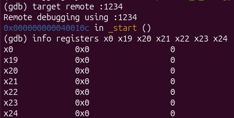
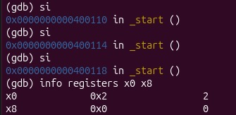
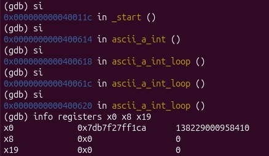
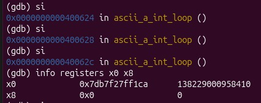
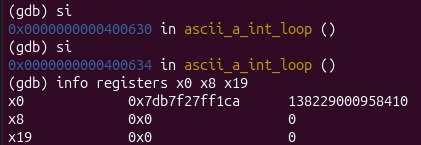
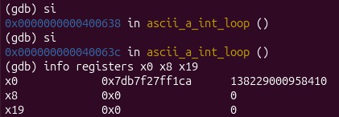
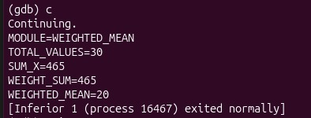
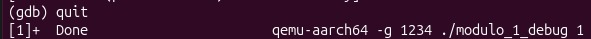

# Módulo 1 - Media Aritmética Ponderada

## Información General

* **Proyecto:** Invernadero Inteligente IoT
* **Curso:** Arquitectura y Organización de Computadoras y Ensambladores 1
* **Archivo fuente:** `modulo_1_media.s`
* **Responsable:** Alison Melysa Pérez Blanco
* **Variable analizada:** Columna seleccionada por el usuario
* **Cantidad de datos procesados:** 30 registros

---

# 1. Descripción del módulo

Este módulo implementa una rutina en lenguaje ensamblador ARM64 encargada de calcular la media aritmética ponderada de los datos almacenados en el archivo `lecturas.csv`.

La columna a procesar es enviada por el dashboard de Python mediante `argv[1]`. Si no se proporciona un argumento, el módulo utiliza la columna 2 por defecto.

Los datos son cargados mediante la rutina `leer_datos` definida en `utils.s`, la cual almacena los 30 valores extraídos dentro del arreglo global `datos`.

Posteriormente se calcula la media aritmética ponderada utilizando pesos crecientes desde 1 hasta 30.

El resultado generado es almacenado en el archivo:

```text
resultado_media.txt
```

---

# 2. Objetivo

Calcular la media aritmética ponderada de una columna seleccionada del archivo `lecturas.csv`.

Para ello se realiza:

* Lectura del número de columna recibido como argumento.
* Carga de los datos mediante `leer_datos`.
* Recorrido de los 30 registros almacenados.
* Cálculo de la suma simple.
* Cálculo de la suma ponderada.
* Cálculo de la suma total de pesos.
* Obtención de la media ponderada.
* Generación del archivo de resultados.

---

# 3. Fórmula Implementada

La media ponderada se calcula mediante:

```text
MEDIA_PONDERADA = Σ(Xi × Wi) / ΣWi
```

Donde:

* Xi = valor leído del archivo CSV.
* Wi = peso asignado a cada dato.

Los pesos utilizados son:

```text
1, 2, 3, 4, ..., 30
```

---

# 4. Algoritmo Implementado

## Paso 1: Lectura del argumento

Al iniciar el programa se verifica si el usuario envió un argumento.

```asm
ldr x0, [sp]
cmp x0, #2
```

Si existe `argv[1]`, se convierte de texto a entero mediante:

```asm
ascii_a_int
```

Si no existe argumento, se utiliza:

```asm
mov x0, #2
```

como columna por defecto.

---

## Paso 2: Carga de datos

El número de columna es enviado a:

```asm
leer_datos
```

La rutina llena el arreglo:

```asm
datos[]
```

con 30 valores de la columna seleccionada.

---

## Paso 3: Inicialización de acumuladores

Antes de iniciar el cálculo se inicializan:

```text
SUM_X = 0
SUMA_PONDERADA = 0
SUMA_PESOS = 0
PESO_ACTUAL = 1
```

---

## Paso 4: Recorrido de los datos

El programa recorre los 30 elementos del arreglo:

```asm
.loop_media
```

Durante cada iteración se realiza:

```text
SUM_X += Xi
SUMA_PONDERADA += Xi × Wi
SUMA_PESOS += Wi
```

Posteriormente:

```text
Wi++
```

---

## Paso 5: Cálculo de la media ponderada

Al finalizar el recorrido se calcula:

```asm
udiv x27, x22, x23
```

equivalente a:

```text
MEDIA_PONDERADA = SUMA_PONDERADA / SUMA_PESOS
```

---

## Paso 6: Construcción del archivo de salida

Los resultados son convertidos a texto utilizando:

```asm
int_a_ascii
```

y posteriormente se almacenan dentro de:

```asm
buffer_salida
```

mediante las rutinas auxiliares:

```asm
.copiar_module
.copiar_total
.copiar_label_sumx
.copiar_label_wsum
.copiar_label_mean
.copiar_cadena
.copiar_newline
```

---

## Paso 7: Escritura del archivo

El archivo de salida se crea mediante:

```asm
openat
```

Posteriormente se escribe usando:

```asm
write
```

y finalmente se cierra mediante:

```asm
close
```

---

# 5. Flujo del Programa

```text
argv[1]
    │
    ▼
ascii_a_int
    │
    ▼
leer_datos()
    │
    ▼
datos[]
    │
    ▼
.loop_media
    │
    ├── SUM_X
    ├── SUMA_PONDERADA
    ├── SUMA_PESOS
    └── MEDIA_PONDERADA
    │
    ▼
buffer_salida
    │
    ▼
resultado_media.txt
```

---

# 6. Uso de Memoria

## Sección .data

Contiene cadenas constantes utilizadas para construir el archivo de salida.

```asm
nombre_salida
linea_module
linea_total
label_sumx
label_wsum
label_mean
```

---

## Sección .bss

Memoria reservada para almacenamiento temporal.

| Variable      | Tamaño    | Descripción                       |
| ------------- | --------- | --------------------------------- |
| buffer_salida | 512 bytes | Texto completo de salida          |
| buf_sumx      | 32 bytes  | Conversión ASCII de SUM_X         |
| buf_wsum      | 32 bytes  | Conversión ASCII de WEIGHT_SUM    |
| buf_media     | 32 bytes  | Conversión ASCII de WEIGHTED_MEAN |

---

# 7. Registros Utilizados

| Registro | Función                                 |
| -------- | --------------------------------------- |
| x0       | Parámetros y retornos                   |
| x1       | Direcciones de memoria                  |
| x2       | Flags y tamaños                         |
| x3       | Permisos                                |
| x8       | Syscalls                                |
| x9       | Posición actual dentro de buffer_salida |
| x10      | Descriptor de archivo                   |
| x19      | Dirección base de datos[]               |
| x20      | SUM_X                                   |
| x21      | Índice del arreglo                      |
| x22      | SUMA_PONDERADA                          |
| x23      | SUMA_PESOS                              |
| x24      | PESO_ACTUAL                             |
| x25      | Xi actual                               |
| x26      | Xi × Wi                                 |
| x27      | MEDIA_PONDERADA                         |
| x29      | Frame Pointer                           |
| x30      | Link Register                           |

---

# 8. Ciclos Utilizados

## Bucle principal

```asm
.loop_media
```

Recorre los 30 elementos almacenados en `datos[]`.

Calcula:

* SUM_X
* SUMA_PONDERADA
* SUMA_PESOS

---

## Ciclos de copia de texto

Utilizados para construir el archivo de salida:

```asm
.lp_mod
.lp_tot
.lp_lsx
.lp_lws
.lp_lmn
.lp_cad
```

---

# 9. Saltos Utilizados

| Instrucción | Función              |
| ----------- | -------------------- |
| b           | Salto incondicional  |
| beq         | Igual                |
| blt         | Menor                |
| cmp         | Comparación          |
| ret         | Retorno de subrutina |

Estos saltos permiten controlar:

* Recepción de argumentos.
* Recorrido del arreglo.
* Construcción del archivo.
* Finalización del programa.

---

# 10. Formato de Entrada

Archivo utilizado:

```text
lecturas.csv
```

Ejemplo:

```csv
ID,TEMP,HUM_AIRE,HUM_SUELO_1,HUM_SUELO_2,LUZ,GAS,RIEGO_1,RIEGO_2
1,28,70,45,48,320,120,0,0
2,29,68,42,47,300,130,0,0
3,31,65,38,43,250,145,1,0
...
30,30,66,41,44,260,150,0,0
```

El módulo puede procesar cualquier columna válida enviada por el dashboard.

---

# 11. Formato de Salida

Archivo generado:

```text
resultado_media.txt
```

Ejemplo:

```text
MODULE=WEIGHTED_MEAN
TOTAL_VALUES=30
SUM_X=865
WEIGHT_SUM=465
WEIGHTED_MEAN=29
```

Descripción de cada campo:

| Campo         | Descripción                           |
| ------------- | ------------------------------------- |
| MODULE        | Nombre del módulo                     |
| TOTAL_VALUES  | Cantidad de registros procesados      |
| SUM_X         | Suma simple de los datos              |
| WEIGHT_SUM    | Suma total de pesos                   |
| WEIGHTED_MEAN | Resultado final de la media ponderada |

---

# 12. Depuración con GDB

Durante las pruebas se utilizó GDB para verificar el funcionamiento del programa.

Se comprobó:

* Recepción correcta de `argv[1]`.
* Carga correcta de la columna seleccionada.
* Ejecución de `leer_datos`.
* Recorrido del arreglo `datos[]`.
* Cálculo de SUM_X.
* Cálculo de SUMA_PONDERADA.
* Cálculo de SUMA_PESOS.
* Obtención de WEIGHTED_MEAN.

---

## Captura 1 - Breakpoint en _start

Descripción:

Se estableció un breakpoint en `_start`, punto de entrada del programa.

### Imagen



---

## Captura 2 - Programa detenido en _start

Descripción:

El programa se encuentra detenido antes de iniciar la ejecución.

### Imagen



---

## Captura 3 - Verificación de argumentos

Descripción:

Se verificó que el valor enviado mediante `argv[1]` fue recibido correctamente.

### Imagen



---

## Captura 4 - Entrada a leer_datos

Descripción:

La rutina `leer_datos` recibe en `x0` el número de columna a procesar.

### Imagen



---

## Captura 5 - Lectura correcta de datos

Descripción:

Se verificó que el arreglo `datos[]` contiene los 30 valores esperados.

### Imagen



---

## Captura 6 - Inicio del cálculo

Descripción:

Comienza el recorrido del arreglo y la acumulación de resultados.

### Imagen



---

## Captura 7 - Resultado final

Descripción:

Se verificó el contenido de:

```text
SUM_X
WEIGHT_SUM
WEIGHTED_MEAN
```

antes de generar el archivo de salida.

### Imagen



---

## Captura 8 - Programa finalizado

Descripción:

El programa terminó correctamente y generó:

```text
resultado_media.txt
```

### Imagen



---
