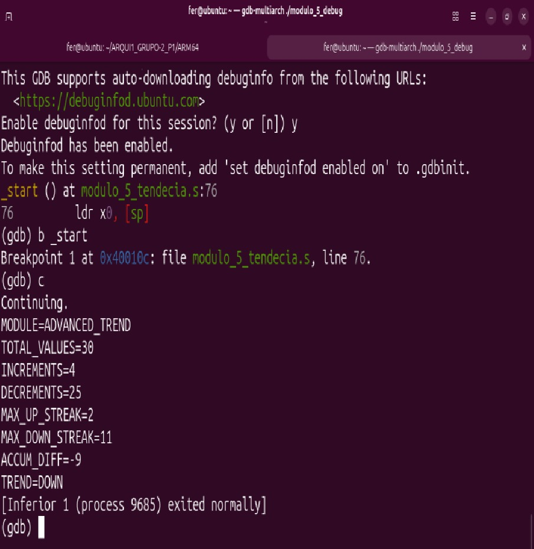
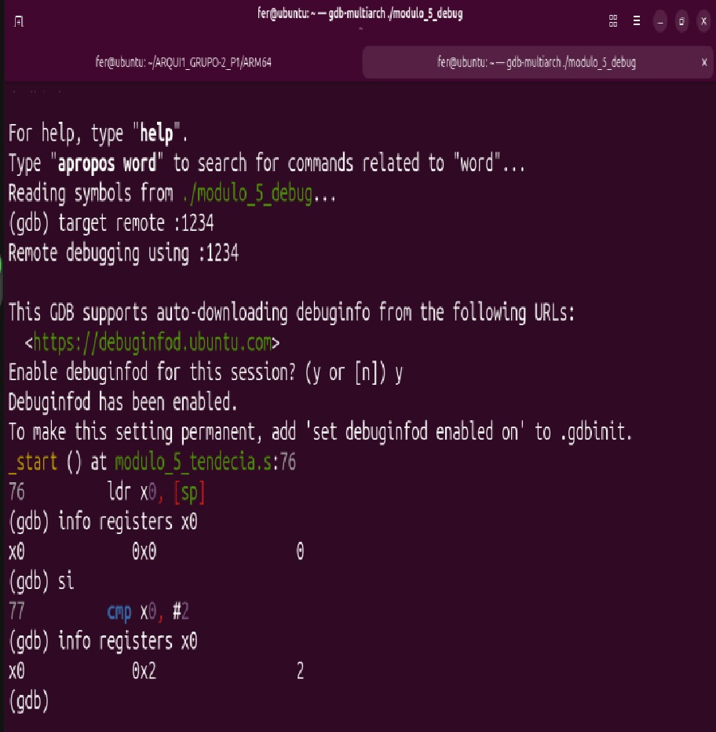
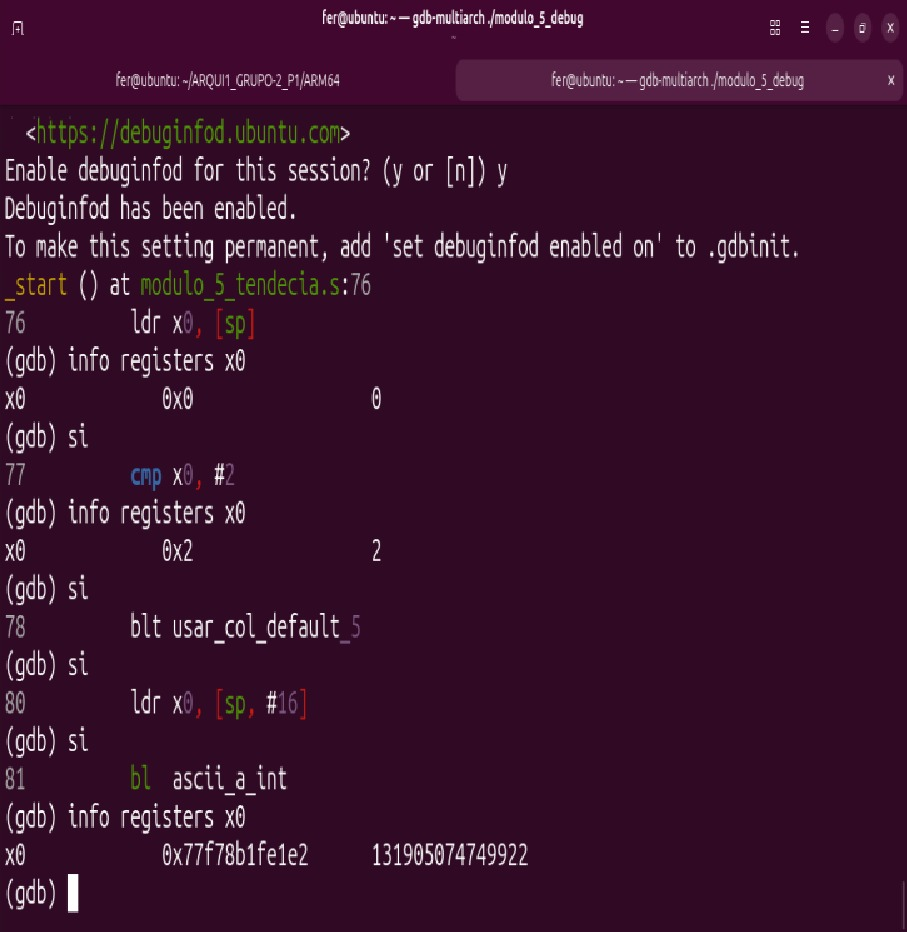
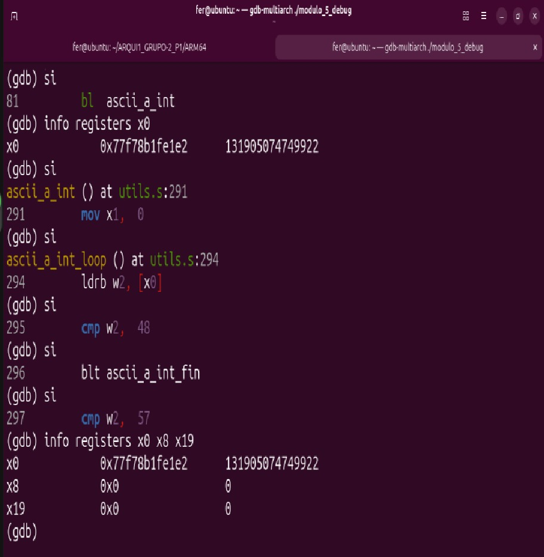
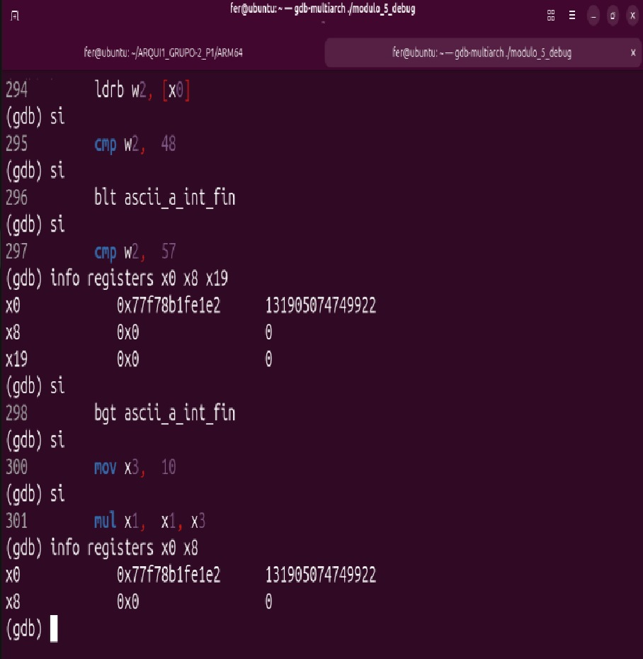
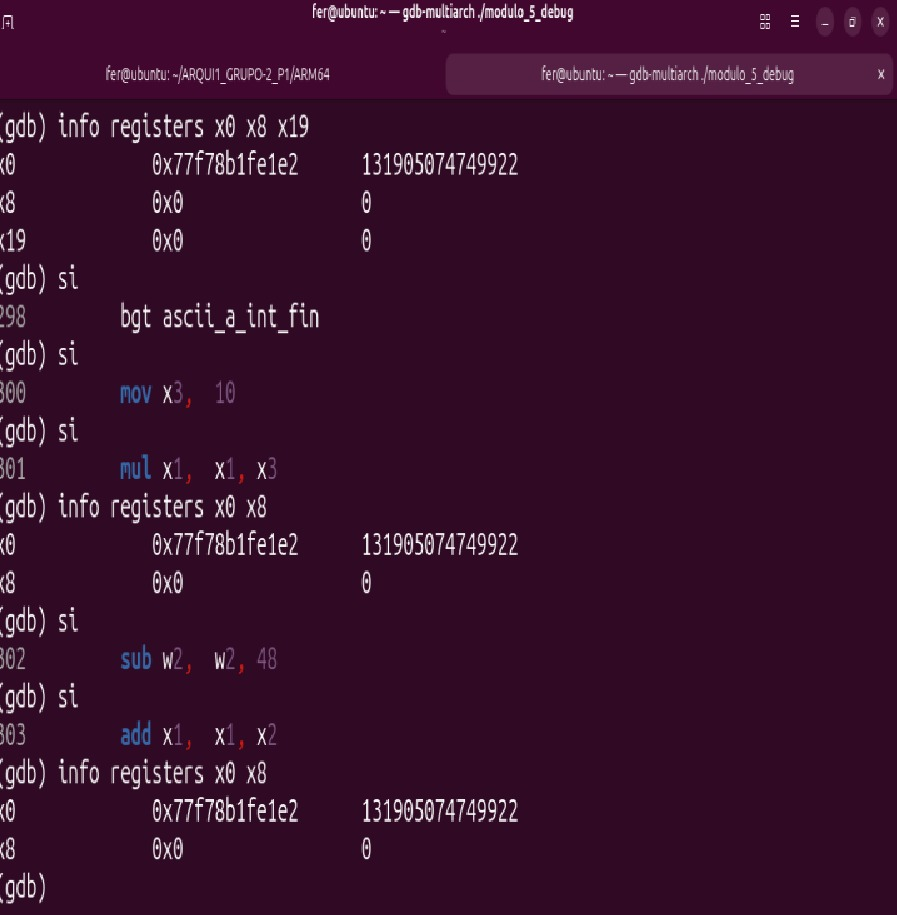
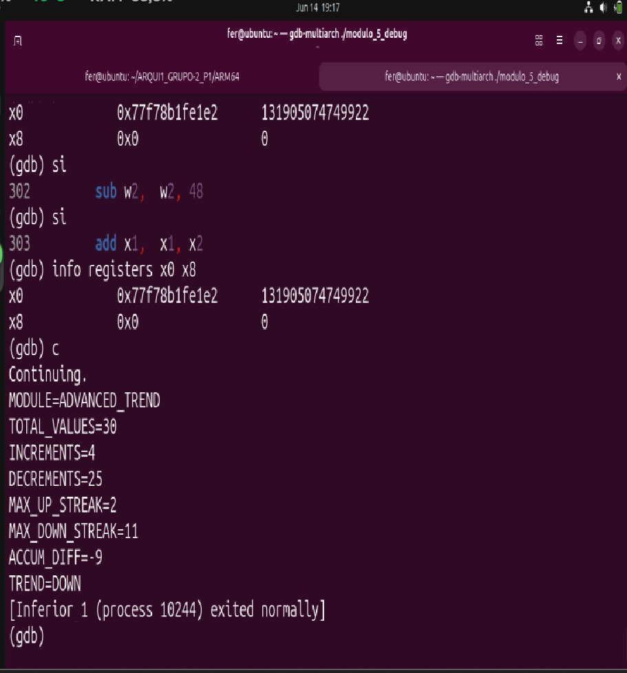
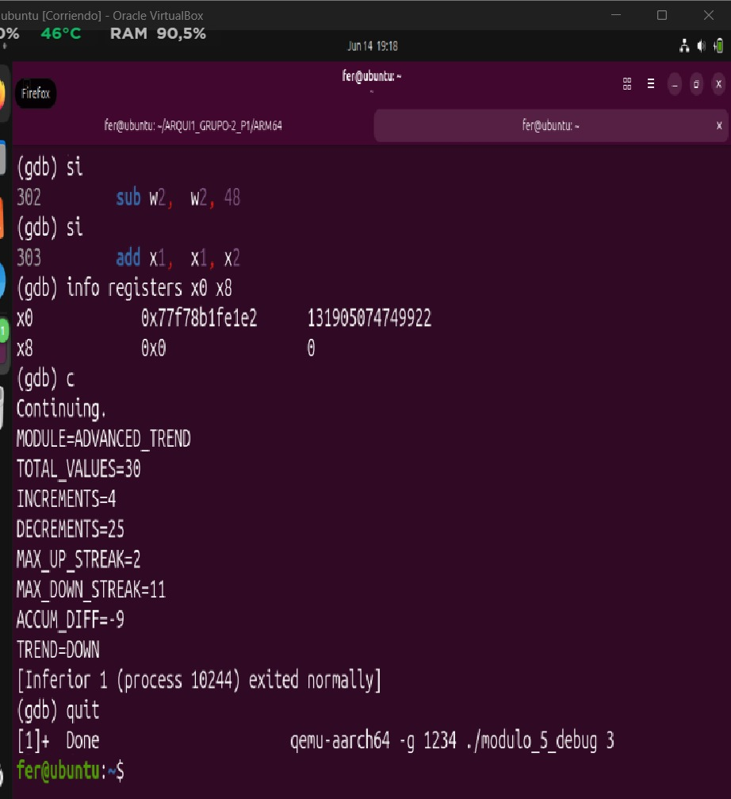

# Módulo 5 - Tendencia Acumulada Avanzada

## Información General

* **Proyecto:** Invernadero Inteligente IoT
* **Curso:** Arquitectura y Organización de Computadoras y Ensambladores 1
* **Archivo fuente:** `modulo_5_tendencia.s`
* **Responsable:** José Fernando Ramírez Ambrocio
* **Variable analizada:** Columna seleccionada por el usuario
* **Cantidad de datos procesados:** 30 registros

---

# 1. Descripción del módulo

Este módulo implementa una rutina en lenguaje ensamblador ARM64 encargada de analizar la tendencia acumulada de una variable almacenada en el archivo `lecturas.csv`.

La columna a procesar es enviada por el dashboard de Python mediante `argv[1]`. Si no se proporciona un argumento, el módulo utiliza la columna 2 por defecto.

Los datos son cargados mediante la rutina `leer_datos` definida en `utils.s`, la cual almacena los 30 valores extraídos dentro del arreglo global `datos`.

Posteriormente se calcula la diferencia entre valores consecutivos para determinar:

* Incrementos
* Decrementos
* Rachas máximas de subida
* Rachas máximas de bajada
* Diferencia acumulada
* Tendencia final

El resultado generado es almacenado en el archivo:

```text
resultado_tendencia.txt
```

---

# 2. Objetivo

Analizar la evolución de una variable del sistema mediante el cálculo de:

* Cantidad de incrementos
* Cantidad de decrementos
* Racha máxima de subida
* Racha máxima de bajada
* Diferencia acumulada
* Tendencia general

---

# 3. Fórmulas Implementadas

Para cada posición del arreglo:

```text
DIFi = Xi - Xi-1
```

Diferencia acumulada:

```text
DIF_ACUM = Σ(DIFi)
```

Determinación de tendencia:

```text
DIF_ACUM > 0  → TREND = UP
DIF_ACUM < 0  → TREND = DOWN
DIF_ACUM = 0  → TREND = STABLE
```

---

# 4. Algoritmo Implementado

## Paso 1: Lectura del argumento

Al iniciar el programa se verifica si el usuario envió un argumento.

```asm
ldr x0, [sp]
cmp x0, #2
```

Si existe `argv[1]`, se convierte de texto a entero mediante:

```asm
ascii_a_int
```

Si no existe argumento, se utiliza:

```asm
mov x0, #2
```

como columna por defecto.

---

## Paso 2: Carga de datos

El número de columna es enviado a:

```asm
leer_datos
```

La rutina llena el arreglo:

```asm
datos[]
```

con 30 valores de la columna seleccionada.

---

## Paso 3: Inicialización

La rutina `calcular_tendencia` inicializa:

```text
INCREMENTS = 0
DECREMENTS = 0
MAX_UP_STREAK = 0
MAX_DOWN_STREAK = 0
ACCUM_DIFF = 0
```

---

## Paso 4: Recorrido del arreglo

El programa recorre los 30 elementos almacenados en memoria.

Para cada posición se calcula:

```text
DIFi = datos[i] - datos[i-1]
```

---

## Paso 5: Clasificación de diferencias

Si:

```text
DIFi > 0
```

entonces:

```text
INCREMENTS++
UP_STREAK++
DOWN_STREAK = 0
```

Si:

```text
DIFi < 0
```

entonces:

```text
DECREMENTS++
DOWN_STREAK++
UP_STREAK = 0
```

Si:

```text
DIFi = 0
```

entonces ambas rachas se reinician.

---

## Paso 6: Actualización de rachas máximas

Durante cada iteración se comparan las rachas actuales con las máximas registradas.

```text
MAX_UP_STREAK
MAX_DOWN_STREAK
```

se actualizan cuando aparece una racha más larga.

---

## Paso 7: Diferencia acumulada

Cada diferencia calculada se suma a:

```text
ACCUM_DIFF
```

Esta variable puede contener valores positivos o negativos.

---

## Paso 8: Determinación de tendencia

Al finalizar el recorrido:

```text
ACCUM_DIFF > 0
```

produce:

```text
TREND=UP
```

Si:

```text
ACCUM_DIFF < 0
```

produce:

```text
TREND=DOWN
```

Si:

```text
ACCUM_DIFF = 0
```

produce:

```text
TREND=STABLE
```

---

## Paso 9: Escritura de resultados

Los resultados son convertidos a texto mediante:

```asm
int_a_ascii
```

y posteriormente escritos en:

```text
resultado_tendencia.txt
```

---

# 5. Flujo del Programa

```text
argv[1]
      │
      ▼
ascii_a_int
      │
      ▼
leer_datos
      │
      ▼
calcular_tendencia
      │
      ▼
escribir_resultado
      │
      ▼
resultado_tendencia.txt
```

---

# 6. Uso de Memoria

## Sección .data

Contiene cadenas constantes utilizadas para construir el archivo de salida.

Variables:

```asm
archivo_salida
str_module
str_total
str_inc_lbl
str_dec_lbl
str_mup_lbl
str_mdn_lbl
str_acc_lbl
str_trend_up
str_trend_down
str_trend_stable
str_minus
```

---

## Sección .bss

Memoria reservada para almacenamiento temporal.

| Variable       | Tamaño   | Descripción               |
| -------------- | -------- | ------------------------- |
| buf_conv       | 32 bytes | Conversión numérica ASCII |
| res_increments | 8 bytes  | Cantidad de incrementos   |
| res_decrements | 8 bytes  | Cantidad de decrementos   |
| res_max_up     | 8 bytes  | Racha máxima de subida    |
| res_max_down   | 8 bytes  | Racha máxima de bajada    |
| res_accum_diff | 8 bytes  | Diferencia acumulada      |

---

# 7. Registros Utilizados

| Registro | Función                    |
| -------- | -------------------------- |
| x0       | Parámetros y retornos      |
| x1       | Direcciones de memoria     |
| x2       | Tamaños y parámetros       |
| x3       | Permisos                   |
| x8       | Syscalls                   |
| x9       | Índices y datos temporales |
| x10      | Valores temporales         |
| x11      | Diferencia actual          |
| x19      | Dirección base de datos[]  |
| x20      | Dirección de resultados    |
| x21      | Índice i                   |
| x22      | INCREMENTS                 |
| x23      | DECREMENTS                 |
| x24      | Racha actual de subida     |
| x25      | Racha actual de bajada     |
| x26      | MAX_UP_STREAK              |
| x27      | MAX_DOWN_STREAK            |
| x28      | ACCUM_DIFF                 |
| x29      | Frame Pointer              |
| x30      | Link Register              |

---

# 8. Ciclos Utilizados

## Ciclo principal

Etiqueta:

```asm
ct_loop
```

Recorre los 30 datos almacenados en memoria.

Durante cada iteración calcula:

```text
DIFi
INCREMENTS
DECREMENTS
RACHAS
ACCUM_DIFF
```

---

## Ciclos de escritura

Etiquetas:

```asm
eun_len
```

Utilizada para determinar la longitud de los números convertidos a texto.

---

# 9. Saltos Utilizados

| Instrucción | Función              |
| ----------- | -------------------- |
| b           | Salto incondicional  |
| bgt         | Mayor que            |
| blt         | Menor que            |
| bge         | Mayor o igual        |
| ble         | Menor o igual        |
| cbz         | Comparar contra cero |
| cmp         | Comparación          |
| ret         | Retorno              |

---

# 10. Subrutinas Implementadas

## calcular_tendencia

Calcula:

* Incrementos
* Decrementos
* Racha máxima de subida
* Racha máxima de bajada
* Diferencia acumulada

---

## escribir_resultado

Abre el archivo de salida y llama a:

```asm
escribir_contenido
```

---

## escribir_contenido

Construye el contenido completo del reporte.

---

## escribir_buf

Escribe un bloque de memoria en un descriptor de archivo.

---

## escribir_uint_nl

Convierte un entero positivo a texto y agrega salto de línea.

---

## escribir_int_nl

Convierte enteros positivos o negativos a texto.

---

# 11. Formato de Entrada

Archivo utilizado:

```text
lecturas.csv
```

Ejemplo:

```csv
ID,TEMP,HUM_AIRE,HUM_SUELO_1,HUM_SUELO_2,LUZ,GAS,RIEGO_1,RIEGO_2
1,28,70,45,48,320,120,0,0
2,29,68,42,47,300,130,0,0
3,31,65,38,43,250,145,1,0
...
30,30,66,41,44,260,150,0,0
```

El módulo puede procesar cualquier columna válida enviada por el dashboard.

---

# 12. Formato de Salida

Archivo generado:

```text
resultado_tendencia.txt
```

Ejemplo:

```text
MODULE=ADVANCED_TREND
TOTAL_VALUES=30
INCREMENTS=16
DECREMENTS=12
MAX_UP_STREAK=4
MAX_DOWN_STREAK=3
ACCUM_DIFF=18
TREND=UP
```

Descripción de cada campo:

| Campo           | Descripción                        |
| --------------- | ---------------------------------- |
| MODULE          | Nombre del módulo                  |
| TOTAL_VALUES    | Cantidad de datos procesados       |
| INCREMENTS      | Cantidad de incrementos detectados |
| DECREMENTS      | Cantidad de decrementos detectados |
| MAX_UP_STREAK   | Racha máxima de subida             |
| MAX_DOWN_STREAK | Racha máxima de bajada             |
| ACCUM_DIFF      | Diferencia acumulada total         |
| TREND           | Tendencia final                    |

---

# 13. Evidencia de Depuración con GDB

## Captura 1 — Breakpoint en _start

Se establece un breakpoint en `_start`, punto de entrada del programa.



---

## Captura 2 — Programa detenido en _start

El programa se detiene en el breakpoint de `_start`.



---

## Captura 3 — Recepción de argumentos

Se verifica que el valor enviado mediante `argv[1]` fue recibido correctamente.



---

## Captura 4 — Entrada a leer_datos

La función `leer_datos` recibe en `x0` el número de columna que será procesado.



---

## Captura 5 — Datos cargados correctamente

Se verifica que el arreglo `datos[]` contiene los 30 registros esperados.



---

## Captura 6 — Cálculo de tendencia

El programa compara cada dato con el anterior para determinar incrementos, decrementos y rachas.



---

## Captura 7 — Resultado acumulado

Se observan los valores finales de:

* INCREMENTS
* DECREMENTS
* MAX_UP_STREAK
* MAX_DOWN_STREAK
* ACCUM_DIFF

antes de escribir el archivo de salida.



---

## Captura 8 — Programa terminado exitosamente

El programa genera correctamente:

```text
resultado_tendencia.txt
```

mostrando la tendencia final calculada.



---
