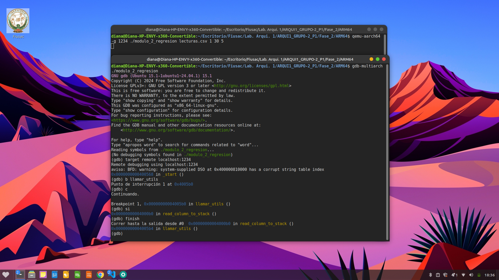
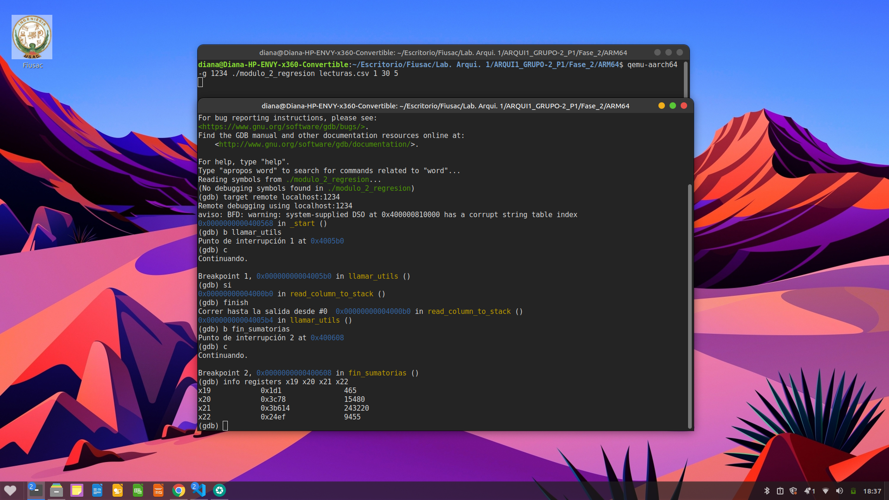
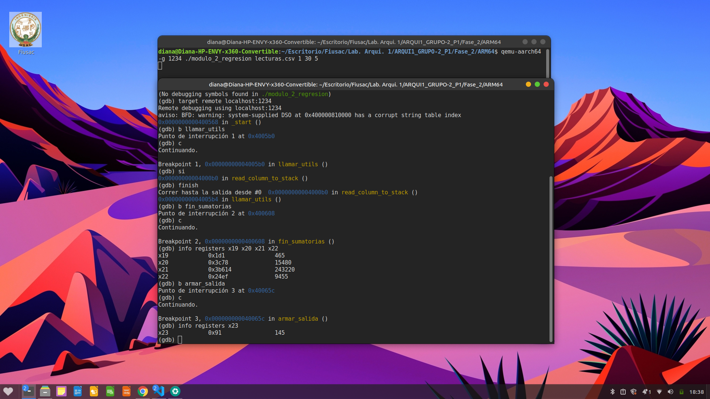
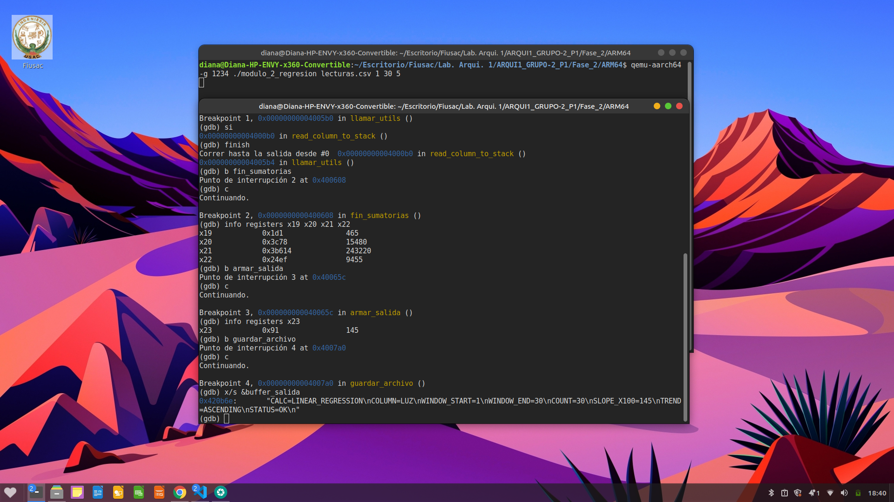
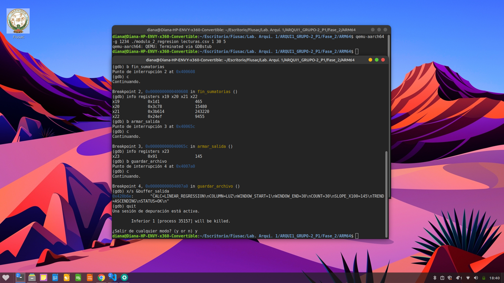

## LABORATORIO ARQUITECTURA DE COMPUTADORES Y ENSAMBLADORES 1
## Diana Myriam Priscila Santizo Cáceres
# Módulo 2: Regresión Lineal Simple
## 1. Descripción
El Módulo 2 tiene como objetivo realizar un análisis de tendencia sobre una serie temporal extraída de un archivo `lecturas.csv`. Utilizando el método de regresión lineal simple, el módulo evalúa si los valores de los sensores (como LUZ, TEMP, HUM) tienen un comportamiento ascendente, descendente o estable en una ventana de tiempo específica.

## 2. Algoritmo Implementado

### Paso 1: Lectura y Parámetros
El programa recibe los argumentos por terminal (archivo, inicio, fin, columna) y los procesa:
1. Valida la cantidad de parámetros (o utiliza valores por defecto, ej. columna 5 para LUZ).
2. Llama a la rutina `read_column_to_stack` en `utils.s`.
3. Valida que existan al menos 2 datos (`COUNT >= 2`) para poder realizar la regresión; de lo contrario, emite un error estructurado.

### Paso 2: Cálculo de Sumatorias
Mediante un ciclo iterativo (`loop_sumatorias`), se recorre el stack de datos para calcular las sumatorias necesarias para las fórmulas de regresión: $\sum X_i$, $\sum Y_i$, $\sum (X_i \cdot Y_i)$ y $\sum (X_i^2)$.

### Paso 3: Evaluación de Tendencia y Construcción del Buffer
Se calcula la pendiente (multiplicada por 100 para mantener precisión entera). Dependiendo del resultado, se salta a las etiquetas condicionales (`set_ascending`, `set_descending`, `es_estable`) para definir la cadena de texto de la tendencia y armar el archivo de salida dinámicamente.

## 3. Lógica Matemática
El módulo implementa la regresión lineal simple mediante los siguientes cálculos en arquitectura ARM64, utilizando multiplicaciones y divisiones con signo (`sdiv`):

1. **Numerador:**
$$Numerador = (N \sum (X_i \cdot Y_i)) - (\sum X_i \cdot \sum Y_i)$$

2. **Denominador:**
$$Denominador = (N \sum (X_i^2)) - (\sum X_i)^2$$

3. **Pendiente Escalada (SLOPE_X100):**
$$M_{X100} = \frac{Numerador \cdot 100}{Denominador}$$

## 4. Uso de Memoria

### Sección .data
Contiene textos estructurados dinámicos, el diccionario de variables de las columnas y las cadenas de resultado para la tendencia (`trend_asc`, `trend_desc`, `trend_stab`). También incluye la estructura de error predefinida.

### Sección .bss
Memoria reservada para almacenamiento temporal:

| Variable | Tamaño | Descripción |
|-----------|---------|-------------|
| `buffer_salida` | 1024 bytes | Buffer donde se arma el archivo completo |
| `buf_conv` | 32 bytes | Buffer temporal para conversiones numéricas |

## 5. Registros Utilizados

| Registro | Uso |
|-----------|-----|
| `x11` | Número de columna |
| `x12` | WINDOW_START |
| `x13` | WINDOW_END |
| `x19` | Sumatoria de X ($\sum X_i$) |
| `x20` | Sumatoria de Y ($\sum Y_i$) |
| `x21` | Sumatoria de X*Y ($\sum X_i \cdot Y_i$) |
| `x22` | Sumatoria de X*X ($\sum X_i^2$) |
| `x23` | Variable independiente $X_i$ / Resultado SLOPE_X100 |
| `x24` | Puntero a los datos en el Stack |
| `x25` | Variable dependiente $Y_i$ / Cadena de TREND final |
| `x27` | COUNT (N) |

## 6. Formato de Salida
El programa genera el archivo `resultado_regresion.txt` con la siguiente estructura (ejemplo para tendencia ascendente):

```text
CALC=LINEAR_REGRESSION
COLUMN=LUZ
WINDOW_START=1000
WINDOW_END=1050
COUNT=50
SLOPE_X100=45
TREND=ASCENDING
STATUS=OK 
```
## 7. Evidencia de Depuración y Verificación (GDB)

Para validar la integridad de los datos y la exactitud de los cálculos, se realizó una depuración exhaustiva utilizando GDB mediante la conexión remota a QEMU.

### 7.1. Validación de Lectura de Datos
Se verificó la correcta extracción de los datos dinámicos desde el stack tras ejecutar la función `read_column_to_stack`.

* **Comando utilizado:** `info registers x12 x13 x27`
* **Análisis:** Se confirma que `x12` (inicio), `x13` (final) y `x27` (count) contienen los valores correctos de la ventana procesada y superan la validación de un mínimo de 2 datos.


> 

---

### 7.2. Verificación de Sumatorias y Cálculos Matemáticos
Tras ejecutar el ciclo `loop_sumatorias` y las operaciones aritméticas, se inspeccionaron los registros para confirmar el resultado de las sumas y de la pendiente.

* **Comando utilizado 1:** `info registers x19 x20 x21 x22` (Para validar sumatorias)
* **Comando utilizado 2:** `info registers x6 x7 x23` (Para validar Numerador, Denominador y Pendiente final)
* **Análisis:** Se validó que las sumas acumuladas y la división final (`x23`) conservan sus signos correctos y son consistentes con la tendencia real.

> 

---

### 7.3. Validación de Finalización y Escritura
Se estableció un punto de interrupción en la etiqueta `guardar_archivo` para verificar que el flujo del programa identificara correctamente la etiqueta condicional de tendencia (`trend_asc`, `trend_desc`, o `trend_stab`).

* **Comando utilizado:** `b guardar_archivo`
* **Análisis:** La interrupción confirma que el programa procesó todos los cálculos sin divisiones por cero y está listo para exportar los resultados.

> 

---

## 8. Resultados Finales
El programa genera exitosamente el archivo `resultado_regresion.txt` con los parámetros calculados. A continuación, se muestra la validación del archivo generado:

> 

---

## 9. Conclusión
El Módulo 2 implementa eficientemente la lógica de regresión lineal, permitiendo una interpretación analítica del comportamiento de los sensores del invernadero. La precisión en el cálculo de las sumatorias y la normalización de la pendiente (X100) aseguran resultados confiables para la toma de decisiones basada en datos.