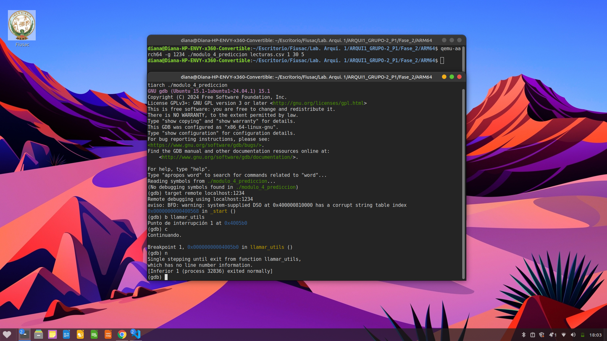
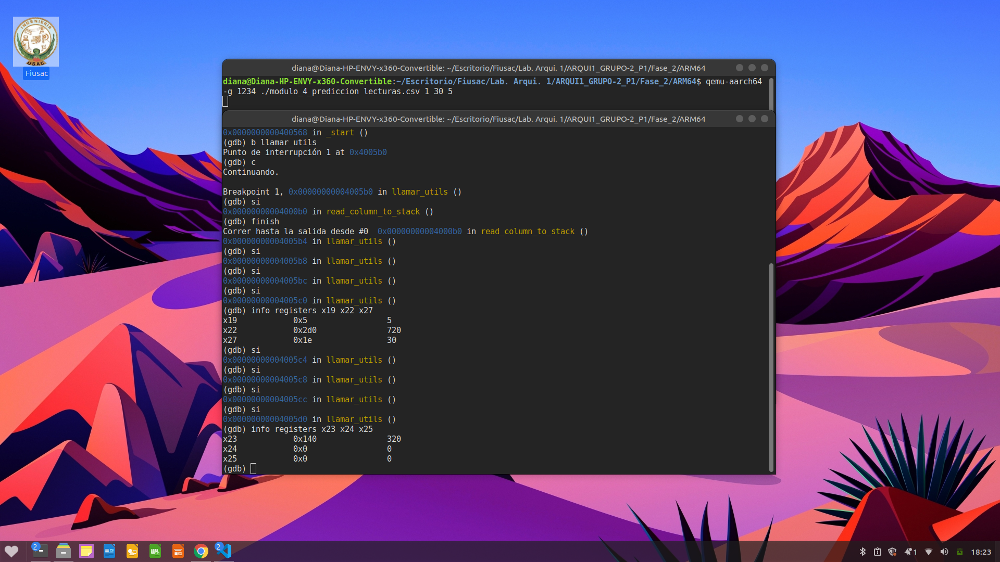
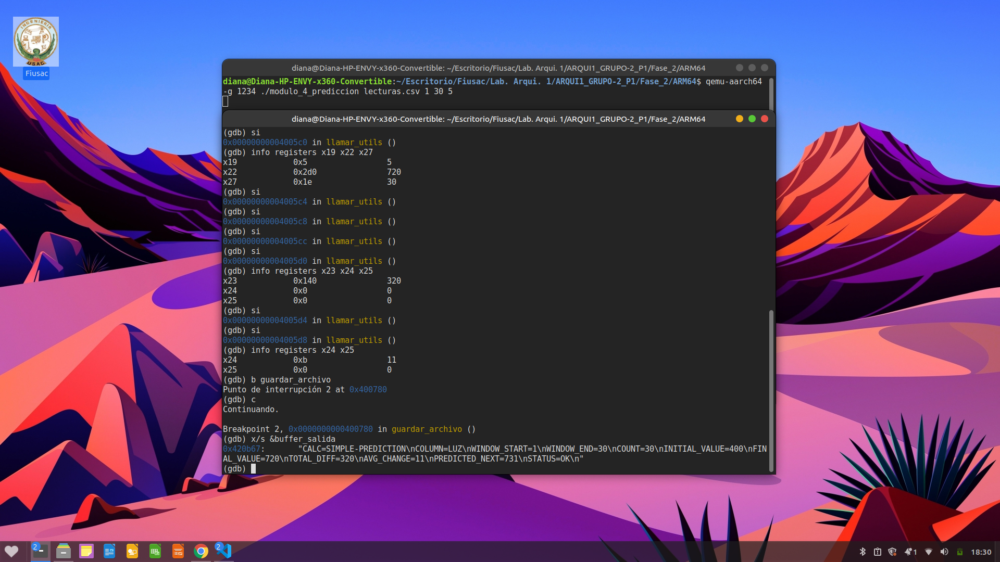
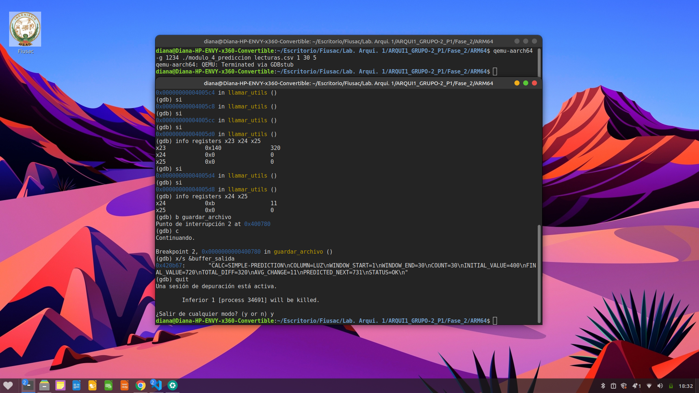

## LABORATORIO ARQUITECTURA DE COMPUTADORES Y ENSAMBLADORES 1
## Diana Myriam Priscila Santizo Cáceres
# Módulo 4: Predicción de Próximo Valor
## 1. Descripción
El Módulo 4 tiene como objetivo realizar una predicción del siguiente valor en una serie temporal extraída de un archivo `lecturas.csv`. Este componente es vital para el **Proyecto Invernadero Inteligente IoT**, ya que permite estimar comportamientos futuros basándose en la tendencia de las lecturas de sensores (como LUZ, TEMP, HUM).

## 2. Algoritmo Implementado

### Paso 1: Lectura y Parámetros
El programa recibe los argumentos por terminal (archivo, inicio, fin, columna) y los procesa:
1. Valida la cantidad de parámetros.
2. Llama a la rutina `read_column_to_stack` en `utils.s`.
3. Identifica los valores de ventana y cantidad (`COUNT`).

### Paso 2: Construcción del Buffer
Se utiliza un diccionario de variables para identificar dinámicamente el nombre de la columna mediante saltos condicionales (`cmp` y `beq`) y formatear el buffer de salida

## 3. Lógica Matemática
El módulo implementa una predicción lineal simple mediante los siguientes cálculos en arquitectura ARM64:
1. **Diferencia Total**: `Final - Inicial`
2. **Promedio de cambio**: `Diferencia / (N - 1)`
3. **Predicción**: `Final + Promedio_cambio`

## 4. Uso de Memoria

### Sección .data
Contiene textos estructurados dinámicos utilizados para generar el archivo de salida y el diccionario de variables de las columnas.

### Sección .bss
Memoria reservada para almacenamiento temporal:

| Variable | Tamaño | Descripción |
|-----------|---------|-------------|
| `buffer_salida` | 1024 bytes | Buffer donde se arma el archivo completo |
| `buf_conv` | 32 bytes | Buffer temporal para conversiones numéricas |

## 5. Registros Utilizados

| Registro | Uso |
|-----------|-----|
| `x11` | Número de columna |
| `x12` | WINDOW_START |
| `x13` | WINDOW_END |
| `x19` | Valor Inicial (Initial Value) |
| `x22` | Valor Final (Final Value) |
| `x23` | Diferencia Total |
| `x24` | Promedio de cambio |
| `x25` | Valor Predicho (PREDICTED_NEXT) |
| `x27` | COUNT (N) |

## 6. Formato de Salida
El programa genera el archivo `resultado_prediccion.txt` con la siguiente estructura:

```text
CALC=SIMPLE-PREDICTION
COLUMN=LUZ
WINDOW_START=1
WINDOW_END=30
COUNT=30
INITIAL_VALUE=400
FINAL_VALUE=720
TOTAL_DIFF=320
AVG_CHANGE=11
PREDICTED_NEXT=731
STATUS=OK 
```
## 7. Evidencia de Depuración y Verificación (GDB)

Para validar la integridad de los datos y la exactitud de los cálculos, se realizó una depuración exhaustiva utilizando GDB mediante la conexión remota a QEMU.

### 7.1. Validación de Lectura de Datos
Se verificó la correcta extracción de los datos dinámicos desde el stack tras ejecutar la función `read_column_to_stack`.

* **Comando utilizado:** `info registers x19 x22 x27`
* **Análisis:** Se confirma que `x19` (inicio), `x22` (final) y `x27` (count) contienen los valores correctos de la ventana procesada.
> 

> 

---

### 7.2. Verificación de Cálculos Matemáticos
Tras ejecutar las operaciones aritméticas en ensamblador, se inspeccionaron los registros para confirmar el resultado de la lógica de predicción.

* **Comando utilizado:** `info registers x23 x24 x25`
* **Análisis:** Se validó que la diferencia (`x23`), el promedio (`x24`) y la predicción final (`x25`) son consistentes con la aritmética esperada.

> 

---

### 7.3. Validación de Finalización y Escritura
Se estableció un punto de interrupción en la etiqueta `guardar_archivo` para verificar que el flujo del programa alcanzara correctamente la etapa de escritura final antes de generar el reporte.

* **Comando utilizado:** `b guardar_archivo`
* **Análisis:** La interrupción confirma que el programa procesó todos los cálculos sin errores y está listo para exportar los resultados.

> 

## 8. Resultados Finales
El programa genera exitosamente el archivo `resultado_prediccion.txt` con los parámetros calculados. A continuación, se muestra la validación del archivo generado:

> 

## 9. Conclusión
El módulo cumple satisfactoriamente con la automatización del proceso de predicción. La implementación en ARM64 garantiza eficiencia en la gestión de memoria y rapidez en los cálculos aritméticos, cumpliendo con los requerimientos técnicos del proyecto de Invernadero Inteligente.