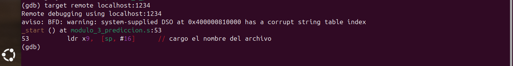
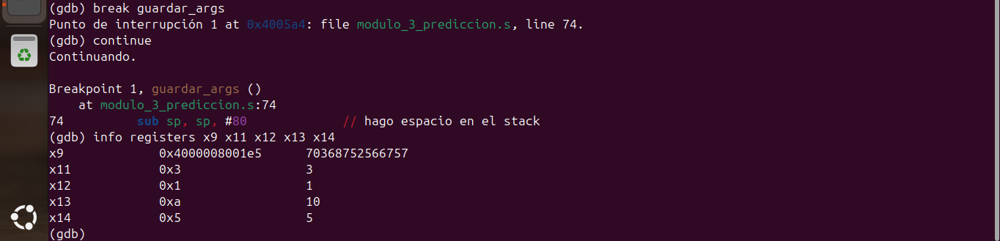
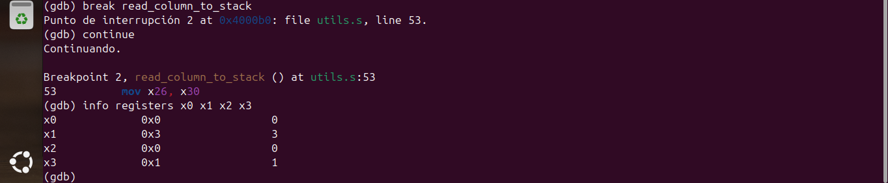
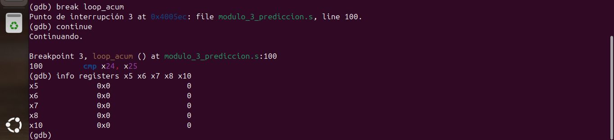
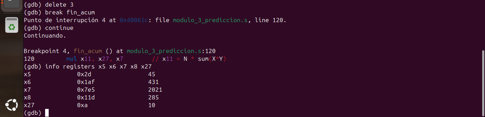
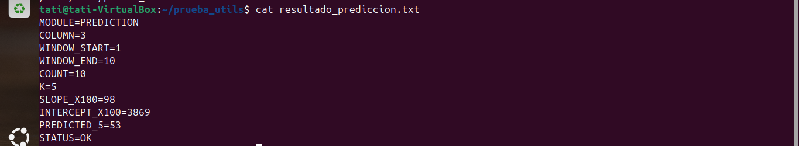

# Módulo 3 - Predicción Futura por Regresión

## Información General

- **Proyecto:** Invernadero Inteligente IoT
- **Curso:** Arquitectura y Organización de Computadoras y Ensambladores 1
- **Archivo fuente:** modulo_3_prediccion.s
- **Responsable:** Jackeline Stephany Rivera Argueta - 202401685
- **Variable analizada:** columna seleccionada por el usuario (parámetro de entrada)
- **Cantidad de datos procesados:** variable, según rango línea inicial - línea final indicado por el usuario

---

# 1. Descripción del módulo

Este módulo implementa una rutina en lenguaje ensamblador ARM64 encargada de estimar un valor futuro de una variable del invernadero, dentro de un rango seleccionado del archivo `lecturas.csv`, utilizando la recta obtenida mediante regresión lineal simple. La predicción se realiza para K lecturas futuras, donde K es un parámetro opcional (por defecto K=5).

El resultado final se almacena en el archivo:

```text
resultado_2_prediccion.txt
```

---

# 2. Objetivo

Estimar el comportamiento futuro de una variable del invernadero mediante el cálculo de:

- Pendiente de la recta de regresión (SLOPE_X100)
- Intercepto de la recta de regresión (INTERCEPT_X100)
- Posición futura estimada (N + K)
- Valor predicho en esa posición futura (PREDICTED)

---

# 3. Algoritmo Implementado

El algoritmo sigue las siguientes etapas:

## Paso 1: Lectura de argumentos

El programa recibe 4 argumentos obligatorios y un quinto opcional:

```text
archivo linea_inicial linea_final columna [K]
```

Cada argumento de texto se convierte a entero mediante:

```asm
ascii_a_int
```

Si no se recibe el argumento K, se usa el valor por defecto K=5 (`cbz x0, guardar_args` detecta la ausencia del quinto argumento).

---

## Paso 2: Reserva de espacio en la pila para los parámetros

A diferencia de otros módulos, este reserva manualmente 80 bytes en la pila (`sub sp, sp, #80`) para guardar columna, línea inicial, línea final, nombre de archivo y K, de forma que estos valores sobrevivan la llamada a `read_column_to_stack` y estén disponibles más adelante para construir la salida.

---

## Paso 3: Lectura del rango solicitado

Se utiliza la rutina:

```asm
read_column_to_stack
```

proporcionada por `utils.s`. Se valida que la cantidad de datos leídos (`x2`) sea al menos 2 antes de continuar.

---

## Paso 4: Cálculo de sumatorias en orden cronológico

El módulo recorre los datos leídos **desde el final hacia el inicio** del bloque devuelto por `read_column_to_stack` (que los almacena en orden inverso), de forma que el índice `i` utilizado como posición temporal (X) corresponda al orden cronológico real de las lecturas:

```text
sum(X) = Σ i
sum(Y) = Σ Y_i
sum(X*Y) = Σ (i * Y_i)
sum(X^2) = Σ (i * i)
```

---

## Paso 5: Cálculo de la pendiente (SLOPE_X100)

```text
NUMERADOR   = (N * sum(X*Y)) - (sum(X) * sum(Y))
DENOMINADOR = (N * sum(X^2)) - (sum(X))^2
```

Si el denominador es cero, el programa reporta un error estructurado (`DIVISION_BY_ZERO`) en lugar de continuar con un cálculo inválido.

```text
SLOPE_X100 = (NUMERADOR * 100) / DENOMINADOR
```

---

## Paso 6: Cálculo del intercepto (INTERCEPT_X100)

```text
INTERCEPT_X100 = ((sum(Y) * 100) - (SLOPE_X100 * sum(X))) / N
```

---

## Paso 7: Cálculo de la predicción

```text
X_FUTURE = N + K
Y_PRED = ((SLOPE_X100 * X_FUTURE) + INTERCEPT_X100) / 100
```

---

## Paso 8: Construcción del archivo de salida

El módulo arma el contenido completo en un buffer en memoria (`buffer_salida`) mediante las subrutinas `copiar_etiqueta`, `escribir_numero` y `agregar_newline`, y al final escribe el buffer completo tanto al archivo de salida como a la salida estándar (pantalla), útil para verificación inmediata durante pruebas.

---

# 4. Flujo del Programa

```text
argv[] (archivo, linea_inicial, linea_final, columna, [K])
       │
       ▼
ascii_a_int() (x3 o x4 veces)
       │
       ▼
guardar_args (reservar 80 bytes en pila)
       │
       ▼
read_column_to_stack()
       │
       ▼
validar N >= 2 ──► (si falla) error_insuficientes_datos
       │
       ▼
loop_acum (recorrido del final al inicio: sum(X), sum(Y), sum(X*Y), sum(X^2))
       │
       ▼
calcular SLOPE_X100 ──► (denominador=0) error_division_cero
       │
       ▼
calcular INTERCEPT_X100 y Y_PRED
       │
       ▼
armar buffer_salida (copiar_etiqueta / escribir_numero / agregar_newline)
       │
       ▼
escribir archivo + escribir pantalla
       │
       ▼
resultado_2_prediccion.txt
```

---

# 5. Uso de Memoria

## Sección .data

Contiene las cadenas utilizadas para generar el archivo de salida y los mensajes de error estructurados.

Variables principales:

```asm
nombre_salida
linea_module
label_column / label_wstart / label_wend / label_count / label_k
label_slope / label_intercept / label_predicted / label_status
err_insuf
err_div0
```

---

## Sección .bss

Memoria reservada para almacenamiento temporal.

| Variable | Tamaño | Descripción |
|-----------|---------|-------------|
| buffer_salida | 2048 bytes | Construcción completa del archivo de salida antes de escribirlo |
| buf_num1 | 64 bytes | Conversión de cada valor numérico a ASCII antes de copiarlo al buffer |

Adicionalmente, el módulo reserva **80 bytes en la pila** (no en `.bss`) para guardar columna, línea inicial, línea final, nombre de archivo, K, y los resultados intermedios (SLOPE_X100, INTERCEPT_X100, Y_PRED, N) antes de restaurar el stack pointer original.

---

# 6. Registros Utilizados

## Registros principales

| Registro | Uso |
|-----------|-----|
| x0 | Parámetros y retornos de syscalls/funciones |
| x1 | Direcciones de memoria / segundo parámetro |
| x2 | Cantidad de datos leídos (devuelto por `read_column_to_stack`) |
| x3 | Posición original de la pila (devuelto por `read_column_to_stack`) |
| x5 | sum(X) |
| x6 | sum(Y) |
| x7 | sum(X*Y) |
| x8 | sum(X^2) |
| x9 | Dato Y_i actual / puntero al nombre de archivo |
| x10 | Contador índice i (posición temporal) |
| x11 | Producto temporal (i*Y_i) / pendiente M_X100 (reutilizado) |
| x12 | Línea inicial / producto temporal (sum(X)*sum(Y)) |
| x13 | Línea final / numerador de la regresión |
| x14 | K (lecturas futuras a predecir) / denominador de la regresión |
| x15 | M_X100 (pendiente escalada por 100) |
| x16 | Intercepto B_X100 |
| x17 | X_FUTURE (N+K) / Y_PRED (valor predicho) |
| x23 | X_FUTURE en el cálculo final de predicción |
| x24 | Puntero al inicio de los datos leídos |
| x25 | Puntero al fin de los datos leídos (se decrementa durante el recorrido) |
| x26 | Posición original de la pila, para restaurarla al finalizar |
| x27 | Cantidad total de datos leídos (N) |
| x30 | Link Register |

---

# 7. Ciclos Utilizados

## Ciclo de acumulación de sumatorias

Etiqueta:

```asm
loop_acum
```

Recorre los datos leídos desde el final hacia el inicio (para respetar el orden cronológico real), acumulando `sum(X)`, `sum(Y)`, `sum(X*Y)` y `sum(X^2)`.

---

## Ciclo de copiado de etiquetas al buffer

Etiqueta:

```asm
loop_et
```

Copia byte por byte una cadena terminada en NULL hacia el buffer de salida, dentro de la subrutina `copiar_etiqueta`.

---

# 8. Saltos Condicionales Utilizados

| Instrucción | Función |
|------------|----------|
| b | Salto incondicional |
| blt | Menor que (validar datos insuficientes) |
| beq | Igual (fin del recorrido del bucle, fin de cadena al copiar) |
| cbz | Comparar contra cero (detectar ausencia del argumento K opcional, denominador igual a cero) |

Los saltos permiten:

- Detectar si se proporcionó o no el argumento opcional K
- Validar que el rango tenga al menos 2 datos antes de calcular
- Evitar la división entre cero cuando el denominador de la regresión es cero
- Controlar el recorrido del ciclo de acumulación de sumatorias
- Controlar el ciclo de copiado de cada etiqueta al buffer de salida

---

# 9. Subrutinas Implementadas

## copiar_etiqueta

Copia una cadena terminada en NULL hacia el buffer de salida, byte por byte, avanzando la posición de escritura `x9`.

Parámetro:

```text
x1 = direccion de la cadena a copiar
```

---

## escribir_numero

Convierte un número entero a texto mediante `int_a_ascii` y lo copia al buffer de salida llamando internamente a `copiar_etiqueta`.

Parámetro:

```text
x0 = numero a convertir y escribir
```

---

## agregar_newline

Agrega un salto de línea (`\n`) al buffer de salida en la posición actual.

---

# 10. Formato de Entrada

Llamada esperada:

```text
./modulo_3_prediccion lecturas.csv 1 10 3 
```

Donde:

- `lecturas.csv` = archivo de entrada
- `1` = línea inicial del rango
- `10` = línea final del rango
- `3` = columna a analizar (posición dentro del CSV)
- `5` = K, cantidad de lecturas futuras a predecir (opcional, por defecto 5)

---

# 11. Formato de Salida

Archivo generado:

```text
resultado_2_prediccion.txt
```

Ejemplo (caso exitoso):

```text
MODULE=PREDICTION
COLUMN=3
WINDOW_START=1
WINDOW_END=10
COUNT=10
K=5
SLOPE_X100=98
INTERCEPT_X100=3869
PREDICTED_5=53
STATUS=OK
```

Ejemplo (caso de error, menos de 2 datos):

```text
MODULE=PREDICTION
STATUS=ERROR
ERROR=INSUFFICIENT_DATA
DETAIL=PREDICTION_REQUIRES_AT_LEAST_2_VALUES
```

Descripción de cada campo:

| Campo | Descripción |
|---------|-------------|
| MODULE | Nombre del módulo ejecutado |
| COLUMN | Columna analizada |
| WINDOW_START | Línea inicial del rango procesado |
| WINDOW_END | Línea final del rango procesado |
| COUNT | Cantidad de datos procesados dentro del rango |
| K | Cantidad de lecturas futuras utilizadas para la predicción |
| SLOPE_X100 | Pendiente de la regresión, multiplicada por 100 |
| INTERCEPT_X100 | Intercepto de la regresión, multiplicado por 100 |
| PREDICTED_K | Valor estimado para K lecturas en el futuro |
| STATUS | Resultado de la ejecución: OK o ERROR |
| ERROR | Código del error, cuando aplica |
| DETAIL | Detalle del error, cuando aplica |

---

# 12. Evidencia de Depuración con GDB

## Captura 1 — Breakpoint en _start


---

## Captura 2 — Lectura de argumentos, incluyendo K


---

## Captura 3 — Entrada a read_column_to_stack


---

## Captura 4 — Primera iteración del ciclo de acumulación


---

## Captura 5 — Cálculo de pendiente e intercepto


---

## Captura 6 — Cálculo de la predicción final


---

## Captura 7 — Programa terminado exitosamente


---

## Captura 8 — Resultados del programa

