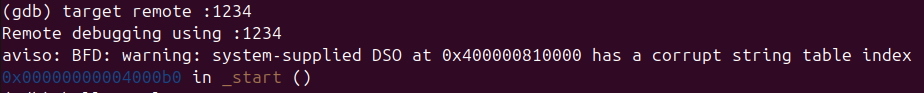
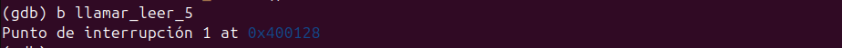
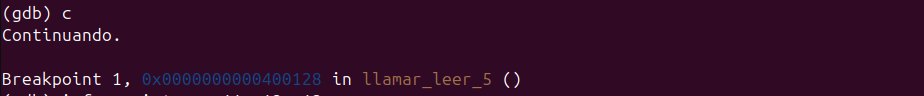
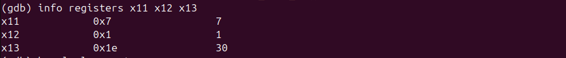
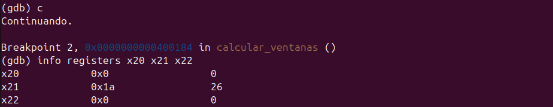
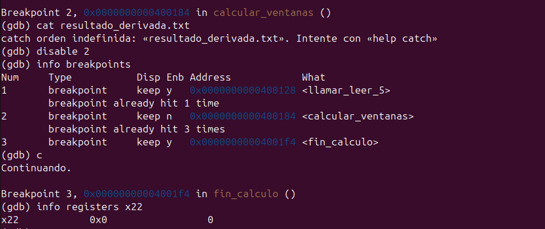
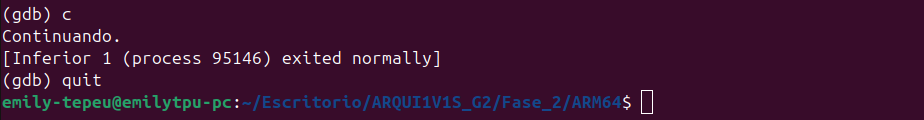
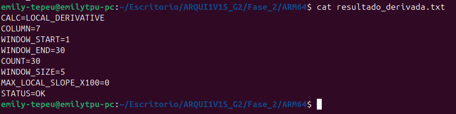

# Módulo 5 - Derivada Suavizada por Regresión Local

## Información General

- **Proyecto:** Invernadero Inteligente IoT
- **Curso:** Arquitectura de Computadores y Ensambladores 1
- **Archivo fuente:** modulo_5_derivada_local.s
- **Responsable:** Emily Maritza Tepeu Guacamaya - 202402955
- **Variable analizada:** Seleccionable mediante parámetro
- **Cantidad de datos procesados:** Variable (mínimo 5 registros)

---

# 1. Descripción del módulo

Este módulo implementa una rutina en lenguaje ensamblador ARM64 que calcula la velocidad de cambio local de una variable del sistema utilizando una aproximación mediante regresión lineal simple.

A diferencia de una derivada tradicional calculada únicamente entre dos puntos consecutivos, este módulo emplea ventanas móviles de cinco valores consecutivos para obtener una pendiente más estable y representativa del comportamiento local de la señal.

Para cada ventana se calcula una pendiente utilizando una versión simplificada de la fórmula de regresión lineal, y al finalizar el recorrido se conserva la pendiente máxima encontrada.

El resultado generado es almacenado en el archivo:

```text
resultado_derivada.txt
```

---

# 2. Objetivo

Determinar la mayor velocidad de cambio local de una serie de datos obtenidos desde el archivo `lecturas.csv`, utilizando ventanas móviles de cinco muestras y regresión lineal simple.

Este análisis permite identificar cambios bruscos en las variables monitoreadas del invernadero, proporcionando una medida del comportamiento dinámico de los sensores.

---

# 3. Algoritmo Implementado

El funcionamiento del módulo se divide en varias etapas.

## Paso 1: Lectura de argumentos

Al iniciar el programa se obtienen los argumentos enviados desde la línea de comandos.

Los parámetros recibidos son:

- Archivo de entrada.
- Línea inicial.
- Línea final.
- Columna que será analizada.

Si el programa no recibe argumentos suficientes, utiliza automáticamente los siguientes valores por defecto:

- Archivo: `lecturas.csv`
- Línea inicial: 1
- Línea final: 30
- Columna: 7

Los parámetros también son almacenados en memoria para posteriormente incluirlos dentro del archivo de salida.

---

## Paso 2: Lectura de datos

El módulo invoca la rutina externa:

```asm
read_column_to_stack
```

Esta función realiza las siguientes tareas:

- Abre el archivo `lecturas.csv`.
- Lee únicamente la columna solicitada.
- Convierte los valores ASCII a enteros.
- Almacena todos los datos temporalmente en el stack.
- Devuelve la dirección de los datos y la cantidad total de valores leídos.

---

## Paso 3: Validación de cantidad de datos

Antes de realizar cualquier cálculo se verifica que existan al menos cinco valores disponibles.

```text
COUNT >= 5
```

Esta condición es necesaria porque la regresión local utiliza ventanas de cinco elementos consecutivos.

Si la cantidad de datos es menor que cinco, el programa genera automáticamente un archivo de error indicando que no existen suficientes registros para realizar el análisis.

---

## Paso 4: Copia de datos

Los datos obtenidos desde el stack son copiados hacia un buffer propio denominado:

```text
datos_copia
```

Esta copia permite recorrer los valores múltiples veces sin modificar el contenido original almacenado por la rutina de lectura.

---

## Paso 5: Construcción de ventanas móviles

Una vez copiados los datos, el módulo comienza a recorrer el arreglo utilizando ventanas consecutivas de cinco elementos.

Por ejemplo:

```text
Ventana 1

10 12 14 18 21

Ventana 2

12 14 18 21 25

Ventana 3

14 18 21 25 28
```

Cada nueva ventana avanza únicamente una posición respecto a la anterior.

Si el archivo contiene **N** valores, el número total de ventanas procesadas es:

```text
TOTAL_VENTANAS = N - 4
```

---

## Paso 6: Cálculo de la pendiente local

Para cada ventana se calcula la pendiente utilizando una regresión lineal simple.

Como las posiciones X siempre corresponden a:

```text
0 1 2 3 4
```

algunos valores permanecen constantes:

```text
ΣX = 10

ΣX² = 30
```

Gracias a ello la ecuación de la pendiente puede simplificarse a:

```text
LOCAL_SLOPE_X100 =
((5 × Σ(XY) − 10 × ΣY) × 100) / 50
```

Dentro del programa esta expresión se simplifica aún más evitando operaciones innecesarias:

```text
LOCAL_SLOPE_X100 =
(5 × Σ(XY) − 10 × ΣY) × 2
```

El resultado se almacena multiplicado por 100 para evitar el uso de números en punto flotante.

---

## Paso 7: Búsqueda de la pendiente máxima

Después de calcular la pendiente correspondiente a cada ventana, el programa la compara con la mayor pendiente registrada hasta ese momento.

Si la nueva pendiente es superior, ésta reemplaza el valor máximo almacenado.

Al finalizar el recorrido de todas las ventanas se conserva únicamente la mayor velocidad de cambio encontrada.

---

## Paso 8: Generación del archivo de resultados

Finalmente el módulo construye un buffer de salida que contiene:

- Tipo de cálculo realizado.
- Columna analizada.
- Rango de líneas procesadas.
- Cantidad de datos.
- Tamaño de la ventana.
- Pendiente máxima encontrada.
- Estado de ejecución.

Posteriormente dicho contenido se escribe en el archivo:

```text
resultado_derivada.txt
```

---

# 4. Flujo del Programa

```text
lecturas.csv
      │
      ▼
Lectura de argumentos
      │
      ▼
read_column_to_stack()
      │
      ▼
Validación de datos
      │
      ▼
Copia de datos
      │
      ▼
Construcción de ventanas
      │
      ▼
Cálculo de pendiente local
      │
      ▼
Comparación de pendiente máxima
      │
      ▼
Generación del archivo
      │
      ▼
resultado_derivada.txt
```

---

# 5. Uso de Memoria

## Sección .data

En esta sección se almacenan las cadenas de texto utilizadas para construir el archivo de salida y los nombres de los archivos empleados durante la ejecución.

Entre las variables más importantes se encuentran:

| Variable | Descripción |
|----------|-------------|
| archivo_default | Nombre del archivo CSV de entrada. |
| archivo_salida | Nombre del archivo generado por el módulo. |
| str_calc | Identifica el tipo de cálculo realizado. |
| label_column | Etiqueta para la columna analizada. |
| label_wstart | Línea inicial procesada. |
| label_wend | Línea final procesada. |
| label_count | Cantidad de datos utilizados. |
| label_wsize | Tamaño de la ventana utilizada. |
| label_max_slope | Pendiente máxima encontrada. |
| str_status_ok | Estado de ejecución correcta. |
| str_status_error | Estado de error. |

---

## Sección .bss

Esta sección reserva memoria para almacenar los datos temporales y los resultados obtenidos durante la ejecución.

| Variable | Tamaño | Descripción |
|----------|--------|-------------|
| buffer_salida | 512 bytes | Buffer donde se construye el archivo de salida antes de escribirlo. |
| datos_copia | 16384 bytes | Copia local de todos los datos leídos desde el archivo CSV. |
| arg_columna | 8 bytes | Columna seleccionada por el usuario. |
| arg_window_start | 8 bytes | Línea inicial procesada. |
| arg_window_end | 8 bytes | Línea final procesada. |
| res_max_slope | 8 bytes | Almacena la mayor pendiente local calculada. |
| buf_num1 | 32 bytes | Conversión de enteros a texto. |
| buf_num2 | 32 bytes | Conversión de resultados numéricos. |
| buf_num3 | 32 bytes | Buffer auxiliar para conversiones. |

---

# 6. Registros Utilizados

Durante la ejecución del módulo se emplean diversos registros de propósito general para almacenar parámetros, recorrer los datos, realizar cálculos y generar el archivo de salida.

## Registros principales

| Registro | Uso |
|----------|-----|
| x0 | Parámetros de entrada y valores de retorno de subrutinas. |
| x1 | Dirección de buffers y cadenas de texto. |
| x2 | Parámetros para llamadas al sistema y conversiones. |
| x3 | Permisos utilizados al crear el archivo de salida. |
| x6 | Puntero utilizado para recorrer los datos copiados. |
| x8 | Número de syscall utilizada por el sistema operativo. |
| x9 | Registro auxiliar para direcciones y valores temporales. |
| x10 | Constantes y operaciones aritméticas auxiliares. |
| x11 | Número de columna seleccionada y cálculos intermedios. |
| x12 | Línea inicial y operaciones auxiliares. |
| x13 | Línea final y cálculo de la pendiente. |
| x15 | Pendiente local calculada para cada ventana. |
| x19 | Puntero al inicio de la ventana actual. |
| x20 | Contador de ventanas procesadas. |
| x21 | Total de ventanas que deben analizarse. |
| x22 | Mayor pendiente encontrada durante la ejecución. |
| x23 | Contador de elementos dentro de cada ventana. |
| x24 | Acumulador de la suma de los valores (ΣY). |
| x25 | Acumulador de la suma ponderada (ΣXY). |
| x26 | Respaldo del stack para restaurarlo al finalizar. |
| x27 | Cantidad total de datos procesados. |
| x29 | Frame Pointer. |
| x30 | Link Register utilizado por las subrutinas. |

---

# 7. Ciclos Utilizados

El módulo utiliza varios ciclos para recorrer los datos y construir el resultado final.

## Ciclo de copia de datos

Etiqueta:

```asm
copia_loop
```

Recorre todos los datos obtenidos desde el stack y los copia al arreglo `datos_copia`, donde posteriormente serán procesados.

---

## Ciclo principal de ventanas

Etiqueta:

```asm
calcular_ventanas
```

Controla el recorrido de todas las ventanas móviles de cinco elementos.

Cada iteración representa una nueva ventana desplazada una posición respecto a la anterior.

---

## Ciclo de procesamiento de cada ventana

Etiqueta:

```asm
calcular_puntos_ventana
```

Recorre los cinco valores pertenecientes a una ventana.

Durante este ciclo se calculan:

- La suma de todos los valores (ΣY).
- La suma ponderada de cada valor por su posición (ΣXY).

Estos acumuladores son utilizados posteriormente para calcular la pendiente local.

---

## Ciclo de copia de cadenas

Etiqueta:

```asm
loop_cc
```

Forma parte de la subrutina `copiar_cadena`.

Su función consiste en copiar carácter por carácter las etiquetas y mensajes hacia el buffer que posteriormente será escrito en el archivo de salida.

---

# 8. Saltos Condicionales Utilizados

El programa utiliza distintas instrucciones de salto para controlar el flujo de ejecución.

| Instrucción | Función |
|-------------|---------|
| b | Salto incondicional. |
| bl | Llamada a una subrutina. |
| bge | Salta cuando un valor es mayor o igual al comparado. |
| blt | Salta cuando un valor es menor al comparado. |
| ble | Salta cuando un valor es menor o igual. |
| beq | Salta cuando dos valores son iguales. |
| cbz | Salta cuando un registro contiene cero. |

Estas instrucciones permiten controlar:

- La validación de argumentos.
- La comprobación del número mínimo de datos.
- La ejecución de ciclos.
- La comparación entre pendientes.
- La escritura del archivo de salida.
- La finalización del programa.

---

# 9. Subrutinas Implementadas

## _start

Punto de entrada principal del programa.

Se encarga de:

- Leer los argumentos enviados al programa.
- Cargar valores por defecto cuando es necesario.
- Invocar la lectura del archivo.
- Validar la cantidad de datos.
- Ejecutar el cálculo de la derivada local.
- Generar el archivo de resultados.

---

## escribir_error_insuficiente

Se ejecuta cuando el archivo contiene menos de cinco valores.

Genera un archivo de salida indicando que no existen suficientes datos para calcular la derivada local y finaliza el programa con un código de error.

---

## copiar_cadena

Copia una cadena de caracteres desde la sección `.data` hacia el buffer de salida.

Es utilizada para escribir todas las etiquetas y mensajes del archivo generado.

---

## copiar_newline

Agrega un salto de línea al buffer de salida.

Se utiliza para mantener el formato correcto del archivo de resultados.

---

## read_column_to_stack

Subrutina externa encargada de:

- Abrir el archivo CSV.
- Leer únicamente la columna seleccionada.
- Convertir los datos de texto a enteros.
- Almacenar temporalmente los valores en el stack.

---

## int_a_ascii

Subrutina externa utilizada para convertir números enteros a cadenas ASCII antes de escribirlos en el archivo de salida.

---

## ascii_a_int

Subrutina externa que convierte los argumentos recibidos desde la línea de comandos en valores enteros utilizables por el programa.

---

# 10. Formato de Entrada

El módulo utiliza como entrada el archivo:

```text
lecturas.csv
```

Ejemplo:

```csv
ID,TEMP,HUM_AIRE,HUM_SUELO_1,HUM_SUELO_2,LUZ,GAS,RIEGO_1,RIEGO_2
1,28,70,45,48,320,120,0,0
2,29,68,42,47,300,130,0,0
3,31,65,38,43,250,145,1,0
...
30,30,66,41,44,260,150,0,0
```

El usuario puede indicar:

- Línea inicial.
- Línea final.
- Columna que desea analizar.

La rutina `read_column_to_stack` extrae únicamente los valores correspondientes a la columna seleccionada.

---

# 11. Formato de Salida

Archivo generado:

```text
resultado_derivada.txt
```

Ejemplo:

```text
CALC=LOCAL_DERIVATIVE
COLUMN=7
WINDOW_START=1
WINDOW_END=30
COUNT=30
WINDOW_SIZE=5
MAX_LOCAL_SLOPE_X100=64
STATUS=OK
```

En caso de que no existan suficientes datos para formar una ventana de cinco elementos, el archivo contendrá un mensaje de error.

Ejemplo:

```text
CALC=LOCAL_DERIVATIVE
COLUMN=7
STATUS=ERROR
ERROR=INSUFFICIENT_DATA
DETAIL=LOCAL_DERIVATIVE_REQUIRES_AT_LEAST_5_VALUES
```

### Descripción de los campos

| Campo | Descripción |
|--------|-------------|
| CALC | Tipo de cálculo realizado por el módulo. |
| COLUMN | Columna analizada del archivo CSV. |
| WINDOW_START | Línea inicial del rango procesado. |
| WINDOW_END | Línea final del rango procesado. |
| COUNT | Cantidad total de datos utilizados. |
| WINDOW_SIZE | Tamaño fijo de la ventana utilizada para la regresión local. |
| MAX_LOCAL_SLOPE_X100 | Mayor pendiente local encontrada, multiplicada por 100 para conservar precisión entera. |
| STATUS | Estado final de la ejecución. |
| ERROR | Tipo de error detectado, cuando aplica. |
| DETAIL | Descripción del error generado. |

---

# 12. Evidencia de Depuración con GDB

## Captura 1 — Conexión remota

Se establece la conexión remota entre GDB y el programa ejecutado mediante QEMU utilizando el puerto 1234. La depuración inicia correctamente en la dirección correspondiente a `_start`, punto de entrada del módulo de derivada local.



## Captura 2 — Breakpoint en llamar_leer_5

Se establece un punto de interrupción en la etiqueta `llamar_leer_5`, donde comienza la lectura de los datos desde el archivo CSV. Esto permite detener la ejecución antes de iniciar el procesamiento de la información.



## Captura 3 — Programa detenido en llamar_leer_5

El programa continúa su ejecución hasta alcanzar el breakpoint definido en `llamar_leer_5`. Esto confirma que la ejecución llegó correctamente a la rutina encargada de cargar los datos que serán utilizados por el algoritmo.



## Captura 4 — Verificación de parámetros

Se inspeccionan los registros utilizados para almacenar los parámetros del programa. El registro `x11` contiene la columna seleccionada (7), mientras que `x12` y `x13` almacenan la línea inicial (1) y la línea final (30), verificando que los argumentos fueron interpretados correctamente.



## Captura 5 — Breakpoint en calcular_ventanas

Se establece un punto de interrupción en la rutina `calcular_ventanas`, donde inicia el cálculo de las pendientes locales utilizando ventanas deslizantes de cinco datos consecutivos.


## Captura 6 — Inicio del cálculo de ventanas

El programa se detiene al iniciar la rutina de cálculo de ventanas. Se observa que `x20` indica la ventana actualmente procesada, `x21` contiene el número total de ventanas (26) y `x22` almacena el valor máximo de pendiente encontrado hasta ese momento, inicialmente igual a cero.



## Captura 7 — Finalización del cálculo

El programa alcanza la etiqueta `fin_calculo`, indicando que terminó el procesamiento de todas las ventanas. Se verifica el contenido del registro `x22`, el cual almacena la pendiente máxima calculada por el algoritmo antes de generar el archivo de salida.



## Captura 8 — Finalización del programa

El programa continúa su ejecución y finaliza correctamente. GDB informa que el proceso terminó normalmente (`exited normally`), indicando que la ejecución del módulo concluyó sin errores.



## Captura 9 — Archivo de salida generado

Se verifica el contenido del archivo `resultado_derivada.txt`, generado por el módulo al finalizar la ejecución. El reporte confirma que se procesó la columna 7 entre las líneas 1 y 30 utilizando ventanas de tamaño 5. El valor calculado para `MAX_LOCAL_SLOPE_X100` fue 0 y el estado final del procesamiento es `STATUS=OK`.

